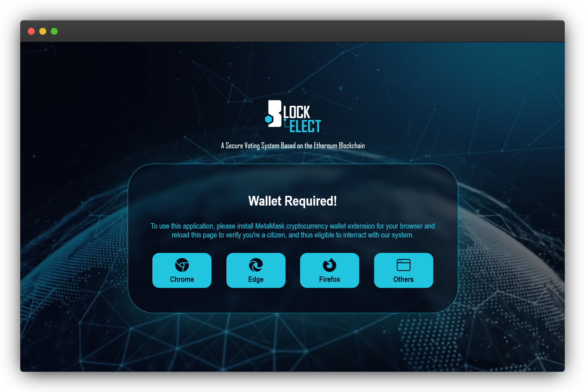
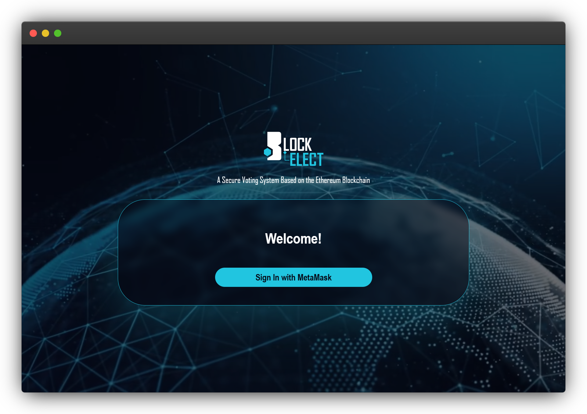
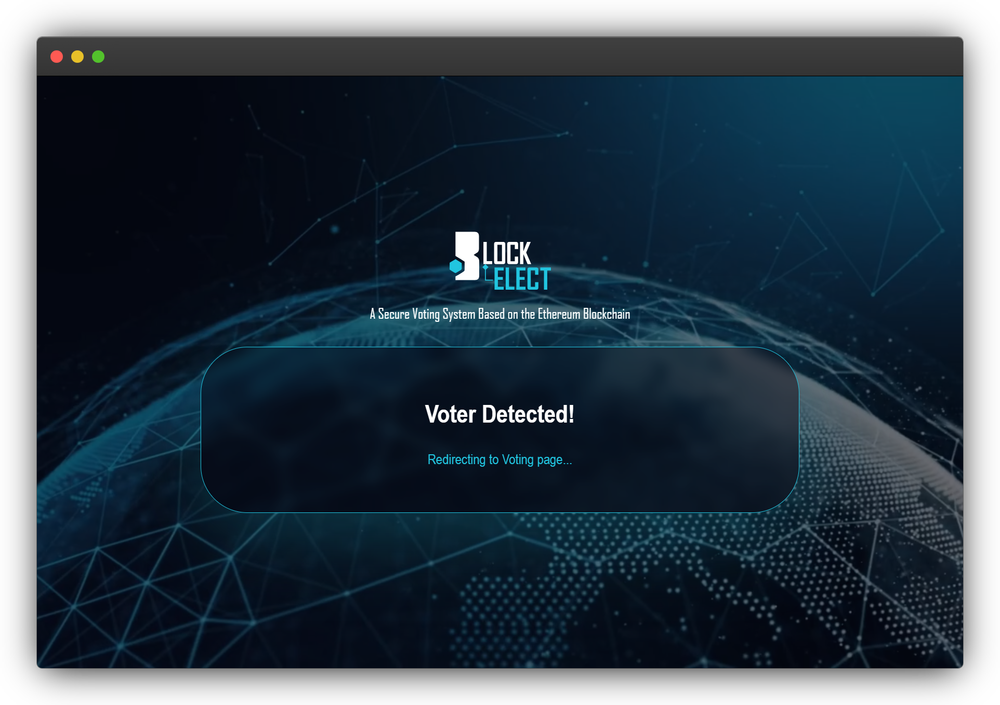
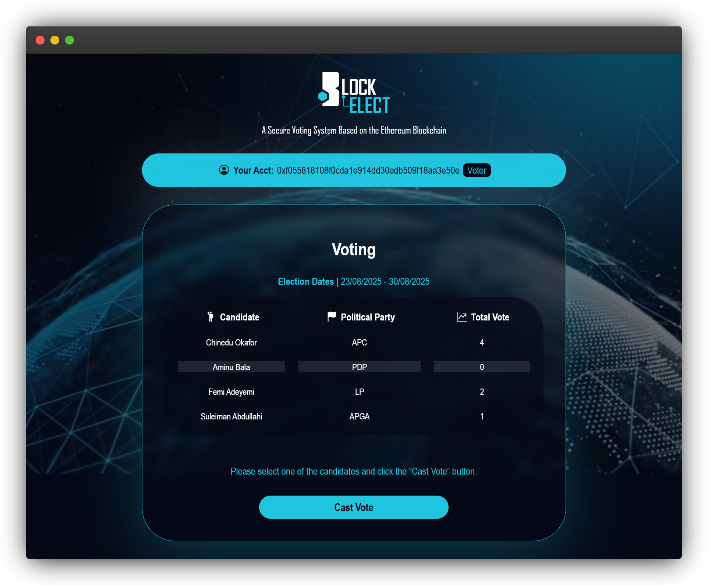
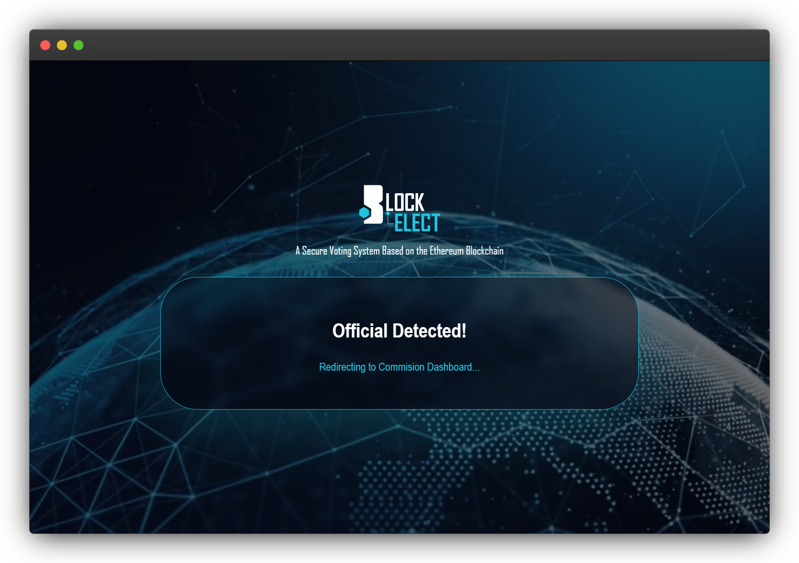
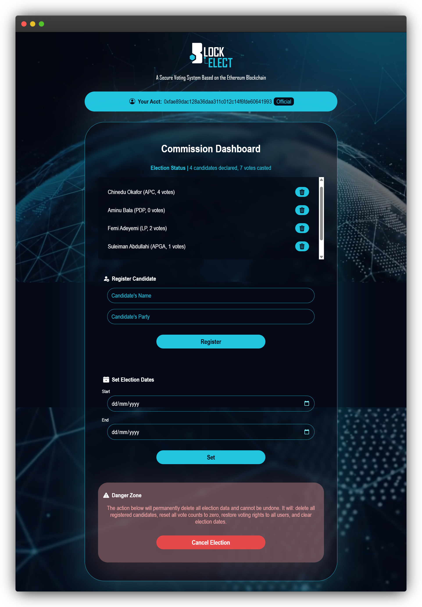

# BLOCKELECT: Blockchain-Based Secure Voting System


## 💡 Abstract

*Traditional electoral systems exhibit critical vulnerabilities including vote manipulation, centralized points of failure, and compromised transparency that undermine democratic integrity. This research presents a decentralised blockchain-based secure voting system designed to address these challenges. The system employs Ethereum smart contracts written in Solidity to enforce immutable voting rules, Web3.js for blockchain integration, and MetaMask wallet authentication for secure voter verification. The architecture implements dual interfaces for voters and electoral commissions, with distributed consensus mechanisms ensuring real-time transaction validation. Smart contracts automatically enforce electoral rules while maintaining cryptographic immutability of voting transactions. The decentralised design eliminates single points of failure by distributing vote storage and validation across multiple nodes. System validation included unit, integration, system, and security testing. Results show prevention of vote tampering, elimination of double voting, and transparent, auditable election results. Implementation used Truffle framework, Ganache blockchain simulation, and Node.js back-end services following an Agile Prototype-based Iterative Development methodology. This work demonstrates blockchain’s feasibility in creating trustworthy electoral systems, offering a viable solution to electoral fraud and public confidence issues.*


## ⚙️ Features

- Uses Web3 wallet authentication for secure, decentralised user address verification.
- Employs Ethereum smart contracts to immutably record and secure votes on-chain.
- Removes centralised databases by using blockchain’s tamper-proof distributed ledger.
- Offers a permissioned commission dashboard with role-based management controls and real-time election monitoring.
- Provides a clean UI for seamless voting, transparent candidate information, and live blockchain feedback.

## 🛠️ Requirements

The following software versions are recommended for deploying this application (other versions might work).

- Node.js `v22.14.0`
- Web3.js `v1.10.0`
- Express.js `v4.17.14`
- Solidity `v0.8.19` (solc-js)
- Truffle `v5.11.5` (core: 5.11.5)
- Ganache GUI `v2.7.1` (or Ganache CLI `v7.9.1`)
- MetaMask `v13.1.0`
- ESBuild `v0.25.9` (or Browserify + Babelify or any ES6 bundler)

## 📱 Screenshots

 
 
 
 
 
 


## 📂 Structure

The project directory is organised as follows:

```
BLOCKELECT (Prototype)              # Project root directory
|
├── build/                          # Contract build artifacts
│   └── contracts/
│       └── VotingSys.json
├── contracts/                      # Solidity smart contracts
│   └── VotingSys.sol
├── dist/                           # Bundled/compiled frontend files for deployment
│   └── app.bundle.js
├── migrations/                     # Truffle migration scripts
│   └── 1_deploy_contracts.js
├── node_modules/                   # NPM dependencies
├── src/                            # Application source files
│   ├── assets/                     # Media assets
│   │   ├── blockchain.mp4
│   │   ├── favicon.svg
│   │   └── logo.svg
│   ├── css/                        # UI stylesheets
│   │   ├── alert.css
│   │   ├── index.css
│   │   └── official.css
│   ├── icons/                      # Bootstrap icon set
│   │   ├── fonts/
│   │   └── bootstrap-icons.css
│   ├── js/                         # JavaScript logic files
│   │   ├── alert.js
│   │   └── app.js
│   ├── sounds/                     # Sound effects
│   │   ├── error.wav
│   │   ├── info.wav
│   │   ├── success.wav
│   │   └── warning.wav
│   ├── index.html                  # Voter-facing interface
│   └── official.html               # Official (admin) interface
├── views/                          # UI screenshots for documentation
│   ├── commission_dashboard.png
│   ├── official_detected.png
│   ├── sign_in.png
│   ├── voter_detected.png
│   ├── voting.png
│   └── wallet_required.png
├── LICENSE                         # Project license file
├── package-lock.json               # Locked versions of Node.js dependencies
├── package.json                    # Project metadata & Node.js package configuration
├── README.md                       # Project documentation
├── server.js                       # Backend server (Node.js application entry-point)
└── truffle-config.js               # Truffle configuration file
```

## ⚖️ License

This project is licensed under the MIT License―you are free to use, modify, and distribute of it, with attribution, but without warranty. To see a full breakdown of this license, click [here](./LICENSE).

**Attribution**

All the sound effects included in this project are from Microsoft Windows, which are the property of Microsoft Corporation. These sounds are used for demonstration purposes only and remain subject to Microsoft’s copyright and licensing terms.

---

Give this repository a ⭐ if you like it.
